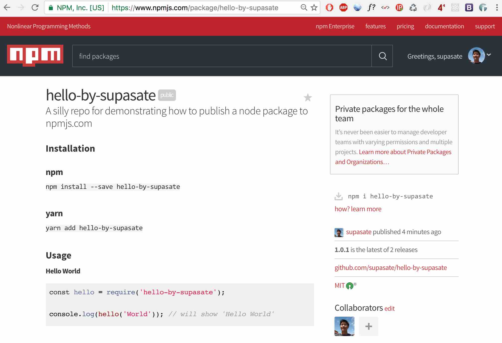

เชื่อว่าทุกคนที่ใช้ Node.js ต้องมีการติดตั้ง node package ผ่านคำสั่ง npm install กันเป็นประจำอยู่แล้วใช่มั้ยครับ (หรือไม่ก็ใช้ [yarn](https://github.com/yarnpkg/yarn) กันแทนแล้ว) ในบทความนี้เราจะเปลี่ยนจากบทบาทผู้บริโภค package มาเป็นผู้ผลิต package กันบ้างครับ โดยจะพูดถึงวิธีการนำ npm package ของตัวเองขึ้นไปยัง npmjs.com เพื่อให้คนอื่นเรียกใช้ package ของเราได้ ซึ่งวิธีการนั้นง่ายกว่าที่หลายคนคิดกันมากๆ ลองมาทำกันดูนะครับ

## ขั้นที่ 0 เตรียม package
สมมติว่าผมมี package ชื่อ `hello-by-supasate` ที่อยากจะ publish ขึ้น npmjs.com โครงสร้าง folder ผมหน้าตาแบบนี้

``` javascript
hello-by-supasate
|-- src
|   |-- hello.js
|-- test
|   |-- hello.spec.js
|-- .gitignore
|-- package.json
|-- README.md
```
(ดูได้ที่ [github repository](https://github.com/supasate/hello-by-supasate))

ไฟล์ที่จำเป็นที่สุดคือไฟล์ `package.json` ลองดูภาพรวมของไฟล์กันก่อนครับ

``` javascript
{
  "name": "hello-by-supasate", // ชื่อ package
  "version": "1.0.0", // เลขเวอร์ชัน
  "description": "A silly repo for demonstrating how to publish a node package to npmjs.com", // คำอธิบาย package จะไปแสดงไว้ใต้ชื่อ package ในเว็บ npmjs.com
  "main": "src/hello.js", // entry point (อ่านคำบรรยายด้านล่าง)
  "scripts": { // npm script ต่างๆที่ใช้ระหว่างพัฒนา
    "test": "mocha"
  },
  "repository": { // บอกว่า source code เราเก็บไว้ที่ไหนและประเภทอะไร
    "type": "git",
    "url": "git+https://github.com/supasate/hello-by-supasate.git"
  },
  "keywords": [ // keywords จะปรากฎในหน้า package ของเราบน npmjs.com
    "npm",
    "hello"
  ],
  "author": "Supasate Choochaisri", // ชื่อผู้เขียนโปรแกรม
  "license": "MIT", // รูปแบบสัญญาอนุญาตที่ให้นำไปใช้งานได้
  "bugs": { // ช่องทางแจ้ง bug ของ package
    "url": "https://github.com/supasate/hello-by-supasate/issues"
  },
  "homepage": "https://github.com/supasate/hello-by-supasate#readme", // หน้าเว็บหลักของ package
  "devDependencies": { // depenendencies ที่ใช้ในระหว่างพัฒนา จะไม่ถูกติดตั้งไปกับคำสั่ง npm install
    "chai": "^3.5.0",
    "mocha": "^3.1.2"
  }
}

```
ส่วนที่สำคัญคือ `main` หรือที่ผม comment ไว้ว่าเป็น entry point
ซึ่งหมายถึงว่าเวลาคนสั่ง `require('hello-by-supasate')` ในโค้ดของเค้าแล้ว ค่าที่ได้มาคือค่าของตัวแปร `exports` ของ module นั้นๆมาให้ผู้ใช้งาน ซึ่งก็คือ `module.exports` ในไฟล์ที่กำหนดไว้ใน `main` ของเรานั่นเอง

เช่น ในไฟล์ `src/hello.js` ของผมมีหน้าตาแบบนี้

``` javascript
module.exports = (name) => `Hello ${name}`

// ฟังก์ชันที่รับ argument ชื่อ name แล้ว return string คำว่า 'Hello' กับชื่อที่รับเข้ามาจากตัวแปร name
```
ดังนั้นเวลาคนอื่นเอาไปใช้ก็สามารถใช้งานได้โดยวิธีนี้
``` javascript
const hello = require('hello-by-supasate')

console.log(hello('World')) // แสดง 'Hello World'
```
หรือถ้าเป็น ES6 ก็เขียนแบบนี้ได้
``` javascript
import hello from 'hello-by-supasate'

console.log(hello('World')) // แสดง 'Hello World'
```

เมื่อ package เราพร้อมให้คนอื่นเรียกใช้แล้ว เราก็มาทำการ publish package ของเรากันเลยครับ


## ขั้นที่ 1 สร้าง account
สร้าง account บนเว็บ npmjs.com โดย username ที่เลือกจะนำไปใช้กับ profile บน npmjs.com  ของเรา (เช่น ของผมจะเป็น www.npmjs.com/~supasate)

หรือถ้าใครขี้เกียจสมัครผ่านเว็บก็สมัครผ่าน command line ได้เลย โดยใช้คำสั่ง `npm adduser` และระบุ username, password, email พอสร้างเสร็จด้วยวิธีนี้เสร็จแล้วจะ log in เข้าสู่ระบบให้อัตโนมัติให้เลยแสนสบาย

```
$ npm adduser
Username: <your_usrname>
Password: <your_password>
Email: (this IS public) <your_email>@<domain.com>
Logged in as <your_username> on https://registry.npmjs.org/.
```
(สังเกตบรรทัดสุดจะขึ้นว่า `Logged in as ...` แปลว่า log in สำเร็จเรียบร้อย)

## ขั้นที่ 2 เข้าสู่ระบบ
สำหรับคนที่ไม่ได้สร้าง account ผ่าน command line หรือเคยมี account อยู่แล้ว สามารถเข้าสู่ระบบได้ด้วยคำสั่ง `npm login`
```
$ npm login
Username: <your_usrname>
Password: <your_password>
Email: (this IS public) <your_email>@<domain.com>
Logged in as <your_username> on https://registry.npmjs.org/.
```

## ขั้นที่ 3 publish package
เมื่อพร้อมแล้วก็สั่งคำสั่ง `npm publish`
``` bash
$ npm publish
+ hello-by-supasate@1.0.0
```
เท่านี้ package ของเราก็ขึ้นไปยัง npmjs.com ให้คนเรียกใช้แล้วดังรูป ง่ายดายมากๆครับ


เราลองมาทดสอบใช้งาน package ของเราดูดีกว่า โดยการสร้าง folder เปล่าๆ แล้วติดตั้ง package ของเราดูกันครับ

```
$ mkdir test-my-package && cd test-my-package
$ npm install --save hello-by-supasate // หรือ yarn add hello-by-supasate
```
หลังจากติดตั้งเสร็จ สร้างไฟล์ `index.js` ดังนี้

``` javascript
const hello = require('hello-by-supasate')

console.log(hello('World'))
```
แล้วสั่ง run ด้วย `node index.js` จะได้ผลดังนี้

```
$ node index.js
Hello World
```

เป็นอันว่า package ของเราใช้งานได้เรียบร้อยครับ

## ขั้นที่ 4 อัพเดท package
คราวนี้ถ้าเราต้องการแก้ไข package ของเราแล้วส่งอัพเดทขึ้นไปใหม่ทำยังไง

สมมติว่าเราทำการแก้ไข README.md เพื่อเพิ่มวิธีการใช้งาน package เราเข้าไปและ git commit เรียบร้อยแล้ว เราสามารถสั่ง `npm version <update_type>` เพื่อเพิ่มเลขเวอร์ชั่นของเราในไฟล์ package.json และ commit ให้โดยอัตโนมัติ

โดย <update_type> สามารถกำหนดเป็นเลขเวอร์ชั่นตามแบบ [semver](http://semver.org/) ได้ (คือ MAJOR.MINOR.PATCH เช่น 1.0.1) หรือถ้าใช้เป็นคำว่า major หรือ minor หรือ patch ก็จะเพิ่มเลขรุ่นตามที่ต้องการของ semver นั้นๆให้

เช่น ถ้าปัจจุบันเป็นเวอร์ชั่น version 1.0.1
สั่ง `npm version patch` จะกลายเป็น 1.0.2
สั่ง `npm version minor` จะกลายเป็น 1.1.0
สั่ง `npm versoin major` จะกลายเป็น 2.0.0

พอเราเพิ่มเลขเวอร์ชันใน package.json ของเราเรียบร้อยแล้ว ให้สั่ง `npm publish` อีกครั้งเพื่ออัพเดท package ใหม่ของเราขึ้นไป
```
$ npm publish
+ hello-by-supasate@1.0.1
```
ลองกลับเข้าไปดูที่หน้าเว็บอีกครั้งก็จะพบว่า package ใหม่ของเราขึ้นไปแล้ว พร้อมกับแสดงข้อมูลจากไฟล์ [README.md](https://github.com/supasate/hello-by-supasate/blob/master/README.md) ที่ผมแก้ไขแสดงไว้ด้วย



ก็หวังว่าเพื่อนๆจะได้ลองนำ package ของตัวเองขึ้น npmjs.com เพื่อให้คนอื่นใช้งานหรือเพื่อให้ตัวเองใช้งาน package ของตัวเองในโปรเจคอื่นกันได้ง่ายขึ้นนะครับ
